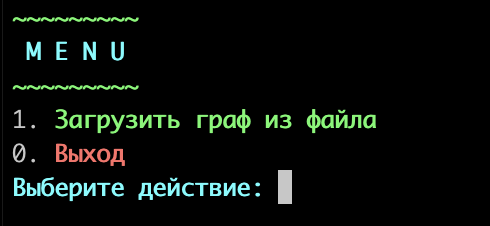
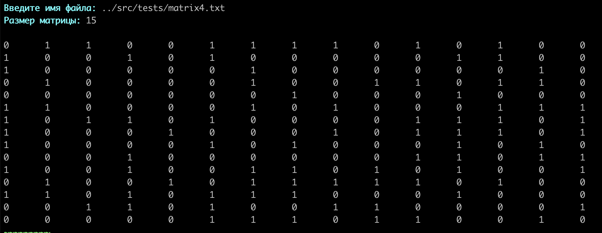
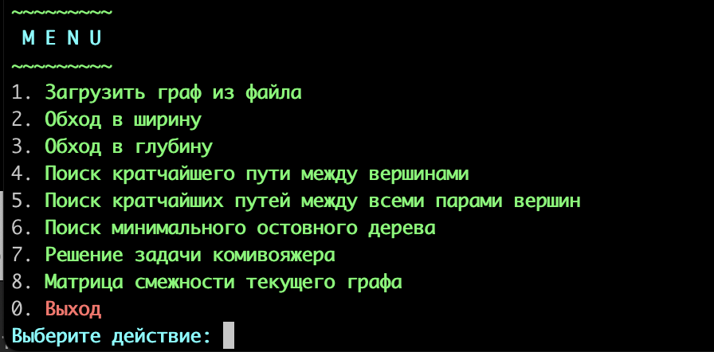

# SimpleNavigator

В данном проекте были реализованы несколько основных алгоритмов на графах. Графы являются одной из базовых структур данных в программировании, которая используется повсеместно. Умения работать с ними крайне важны.

Реализованные алгоритмы:

1. нерекурентный поиск в глубину от заданной вершины;
2. поиск в ширину в графе от заданной вершины;
3. поиск кратчайшего пути алгоритмом Дейкстры;
4. поиск кратчайших путей между всеми парами вершин алгоритмом Флойда-Уоршелла;
5. поиск наименьшего остовного дерева в графе алгоритмом Прима;
6. решение задачи коммивояжера с помощью муравьиного алгоритма.

 _Первая страница программы_  

 _Ввод файла и вывод его матрицы смежности_  

 _Главное меню_  

 _Обход в ширину_  

 _Пары путей между вершинами_  

 _Минимальное остовное дерево_  